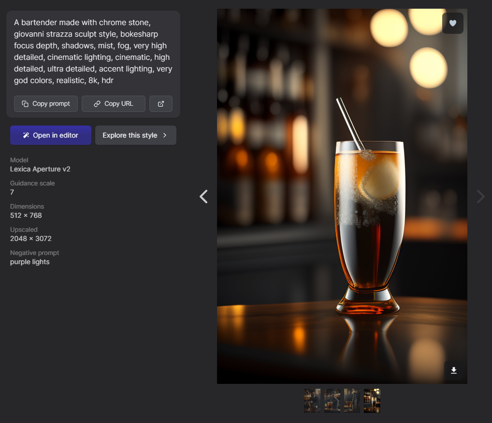

#   La Bottega Del Vecchio

## Descripción
"La Bottega Del Vecchio" es un proyecto de Desarrollo Web que realicé. Simula ser un sitio web para un bar muy reconocido de Argentina, Buenos Aires.

Las imágenes están hechas con [Lexica Art](https://lexica.art/). Éste, es un sitio de generador de imágenes hechas con inteligencia artificial (IA). El cual yo puedo buscar imágenes hechas por otra gente o generar mis propias. Acá muestro un ejemplo de cómo se ve un prompt hecho por un tercero. Esta imagen, fue incluida en mi proyecto.

## Lenguajes que utilicé:

* HTML5
* CSS3
* JS

## Detalles a tener en cuenta:
1. Es mi primer proyecto de desarrollo web, puede tener errores.
2. Debido al punto anterior, puede haber fallas en el maquetado responsive.